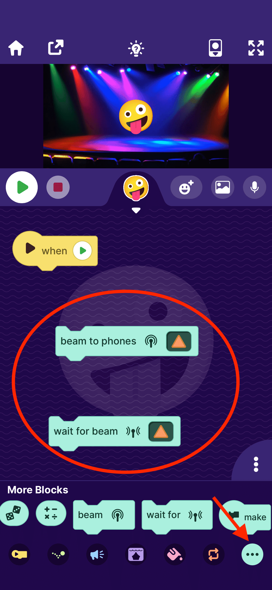

# OctoStudio

This Python library pass messages between Python and [OctoStudio](https://octostudio.org/en/).

Specifically, it works with two blocks of OctoStudio:

- beam to phones
- wait for beam (work-in-progress)





## Install

```
# Python >= 3.10
pip install octostudio
```

## Usage

```
from octostudio import OctoStudio

def on_message(shape):
    print(shape)

octo = OctoStudio()
octo.on_message = on_message
octo.start()
```


## For MicroBlocks users

This library was originally used to bridge OctoStudio's Bluetooth radio with MicroBlocks' wifi radio.

To do this you need to install this package, then run the command: `octostudio-microblocks-bridge`

Take a look at the [inner workings](./octostudio/microblocks.py).

## For Scrarch users

Install dependencies:

```bash
pip install paho-mqtt octostudio
``` 

run the command: `octostudio-scratch-bridge`. Take a look at the [inner workings](./octostudio/scratch.py).


Open [the demo project](https://create.codelab.club/projects/57459/editor/)

[OctoStudio & Scratch demo video](https://wwj718.github.io/post/img/octo-scratch.mp4)

### Customize

octostudio-scratch-bridge uses the default MQTT broker and account. Other users may also be using it. If you want to use your own broker and account, you can run the following code instead of the default octostudio-scratch-bridge:

```python
# custom octostudio-scratch-bridge
import paho.mqtt.client as mqtt
from octostudio import OctoStudio

mqtt_client = mqtt.Client()
# You can use other MQTT broker. If you want to use it with Scratch, make sure the MQTT broker supports wss protocol
mqtt_client.username_pw_set('guest', 'test')
mqtt_client.connect("mqtt.aimaker.space", 1883, 60)

def on_message(shape):
    mqtt_client.publish("octo_message", shape)
octo = OctoStudio()
octo.on_message = on_message
octo.start()
```

## For Snap! users

Install dependencies:

```bash
pip install paho-mqtt octostudio
``` 

run the command: `octostudio-snap-bridge`. Take a look at the [inner workings](./octostudio/snap.py).

Open [the demo project](https://snap.berkeley.edu/project?username=alan_russell&projectname=octostudio%2dsnap%2ddemo)

## FAQ

### How to send a message to OctoStudio?

[send a message to OctoStudio](https://wwj718.github.io/post/%E7%BC%96%E7%A8%8B/extend-octostudio/#%E5%BE%80-octostudio-%E9%87%8C%E5%8F%91%E9%80%81%E6%B6%88%E6%81%AF)

I implemented this part directly in MicroBlocks instead of the bridge. I will update the relevant principles to this article soon.

### Messages being delayed

Reference here: [Maximum rate that advertisements can be scanned/read](https://github.com/hbldh/bleak/discussions/831).

No solution found yet.

[Related source code](https://github.com/wwj718/octostudio_py/blob/main/octostudio/__init__.py#L53), looking forward to you improving it.